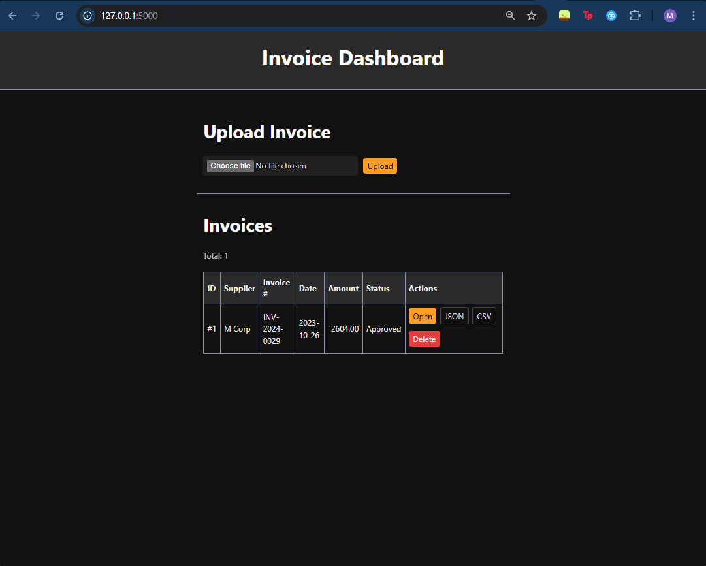
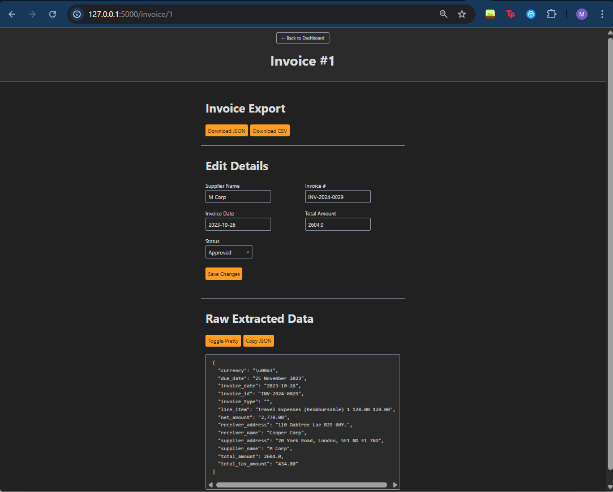

# Invoice Parser App (Flask + Google Document AI)

Upload a PDF invoice → extract structured fields (supplier, invoice #, date, totals) → review & edit → export JSON/CSV.

🔗 **Live Repo:** [github.com/Moqo12/invoice-parser-app](https://github.com/Moqo12/invoice-parser-app)

---

## Screenshots

### Dashboard
Shows uploaded invoices with quick actions (Open, JSON, CSV, Delete).  


### Invoice Details
Review, edit, and export structured invoice data.  


---

## Why this project

- Shows end-to-end delivery: backend, data extraction, cleaning, and a usable UI.
- Integrates a cloud AI API (Google Document AI) with a Flask app.
- Normalizes messy OCR data (e.g., trims supplier punctuation, ISO-dates).

---

## Features

- 📤 PDF upload
- 🤖 Google Document AI Invoice Parser integration
- 🧹 Cleaning & normalization (supplier name, date, amount)
- ✏️ Edit & review screen
- 📑 Export to JSON/CSV
- 🗄 SQLite persistence
- 🗑 Safe delete button for cleanup

---

## Tech Stack

**Python, Flask, SQLAlchemy, Google Cloud Document AI, HTML/CSS/JS**

---

## Setup Instructions

Clone the repo:

```bash
git clone https://github.com/Moqo12/invoice-parser-app.git
cd invoice-parser-app
